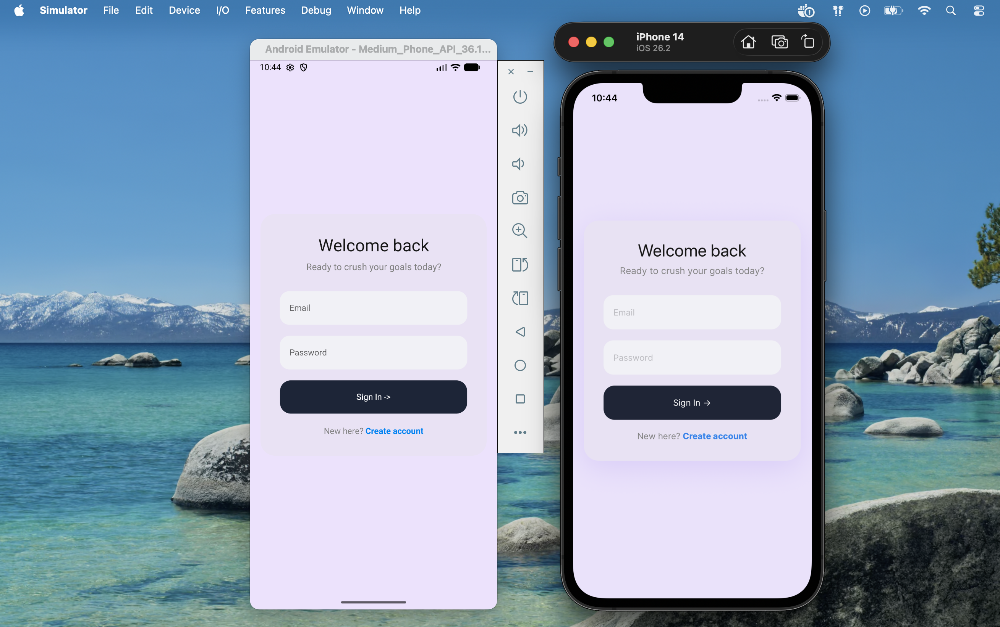
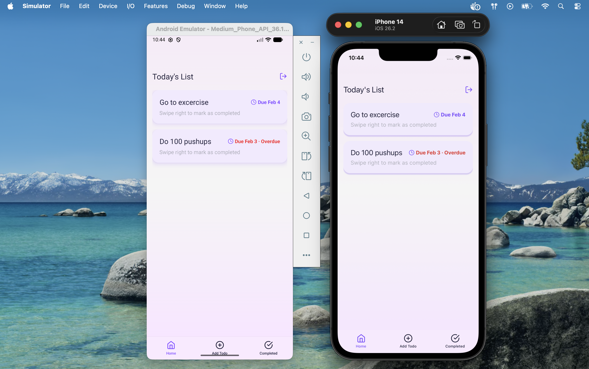
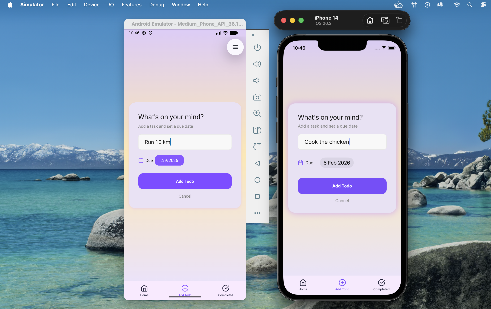
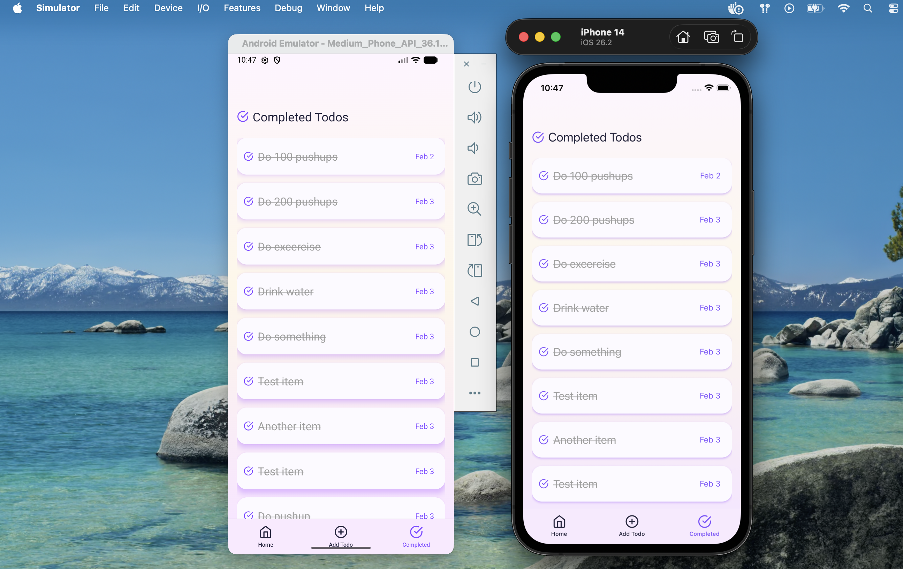

# TodoApp – Full Stack Mobile Application

A production-ready **full stack Todo application** consisting of:

- 📱 **Mobile App** built with **React Native (Expo + TypeScript)**
- 🧠 **Backend API** built with **.NET 9**, **Clean Architecture**, and **JWT authentication**

This project demonstrates how to design a **clean, maintainable, and scalable system** across both backend and mobile layers, focusing on real-world architecture, authentication, and API-driven state.

---

## 📸 App Design Preview

> The UI design was carefully crafted before implementation and then matched to the final mobile app screens.

### Authentication


### Active Todos (Home)


### Add New Todo


### Completed Todos


---

## 🧩 Project Overview

### What this app does
- Secure user authentication
- Create and manage todos
- Track completed tasks
- View completed todo history

### What this app **does not** do
- No mock data
- No offline-only logic
- No client-only features not backed by the API

> The mobile app strictly follows backend-supported functionality.

---

## 🏗️ Monorepo Structure

```
todo-app/
├── src/
│ ├── TodoApp.API/
│ ├── TodoApp.Application/
│ ├── TodoApp.Domain/
│ ├── TodoApp.Infrastructure/
│ └── TodoApp.sln
│
├── mobile/
│ ├── app/
│ │ ├── (tabs)/
│ │ │ ├── _layout.tsx
│ │ │ ├── index.tsx
│ │ │ ├── add-todo.tsx
│ │ │ └── completed-todos.tsx
│ │ │
│ │ ├── auth/
│ │ │ ├── _layout.tsx
│ │ │ └── index.tsx
│ │ │
│ │ ├── _layout.tsx
│ │ └── index.tsx
│ │
│ ├── src/
│ │ ├── components/
│ │ │ └── TodoItem.tsx
│ │ │
│ │ ├── config/
│ │ │ └── tamagui.config.ts
│ │ │
│ │ ├── lib/
│ │ │ └── api.ts
│ │ │
│ │ └── store/
│ │ ├── auth.store.ts
│ │ └── todo.store.ts
│ │
│ └── README.md
│
└── README.md
```
---

## 🔐 Authentication Flow (End-to-End)

1. User signs in from the mobile app
2. Backend validates credentials
3. JWT access token is issued
4. Token is stored in mobile state
5. All protected requests include:
6. User identity is resolved **only from JWT claims**

> No `userId` is ever sent from the client.

---

## 🧠 Backend Overview

### Architecture
The backend follows **Clean Architecture** principles:

- **API** – HTTP, authentication, controllers
- **Application** – Use cases, DTOs, business services
- **Domain** – Core entities & rules (pure C#)
- **Infrastructure** – Database, EF Core, repositories

### Backend Features
- JWT Authentication
- Todo CRUD (create, complete, list)
- Completed todo history
- Claims-based authorization
- Global exception handling
- PostgreSQL with EF Core

### Tech Stack
- .NET 9 Web API
- Entity Framework Core
- PostgreSQL
- JWT Bearer Authentication
- Docker & Docker Compose

---

## 📱 Mobile App Overview

### Architecture
- Expo Router for navigation
- Zustand for global state
- API-driven data flow
- Feature-based screen structure

### Mobile Features
- Sign in
- View active todos
- Add new todo
- Complete todo
- View completed todos

### Tech Stack
- React Native
- Expo
- TypeScript
- Tamagui (UI)
- Axios
- Zustand

---

## 🔄 API Endpoints (Used by Mobile)

### Authentication
| Method | Endpoint | Description |
|------|---------|-------------|
| POST | /api/auth/signin | Sign in & get JWT |

### Todos (Authenticated)
| Method | Endpoint | Description |
|------|---------|-------------|
| POST | /api/todo/add | Create todo |
| POST | /api/todo/{id}/complete | Complete todo |
| GET | /api/todo/user | Active todos |
| GET | /api/todo/user/completed | Completed todos |

---

## ⚙️ Environment Configuration

### Backend
```json
{
  "ConnectionStrings": {
    "DefaultConnection": "Host=localhost;Database=YOUR_DB;Username=YOUR_USER;Password=YOUR_PASSWORD"
  },
  "Jwt": {
    "Key": "YOUR_SECRET_KEY",
    "Issuer": "TodoApp.API",
    "Audience": "TodoApp.API",
    "DurationInMinutes": 60
  }
}
```
### Mobile
```
EXPO_PUBLIC_API_URL=http://localhost:5197
```

## 🚀 Running the Project
### Backend
```
dotnet restore
dotnet ef database update --startup-project TodoApp.API --project TodoApp.Infrastructure
dotnet run --project TodoApp.API
```

### Mobile
```
cd mobile
npm install
npx expo start
```

## Design Philosophy
- Backend-driven features only
- Clean architecture on both layers
- Mobile-first UX
- Real-world production mindset
- Portfolio-quality codebase

## License
This project is licensed under the MIT License.

## 👤 Author
**Oğuzhan Bilgin**
- [Github](https://github.com/oguzbilgin)
- [LinkedIn](https://www.linkedin.com/in/oguzhanbilgin/)
---